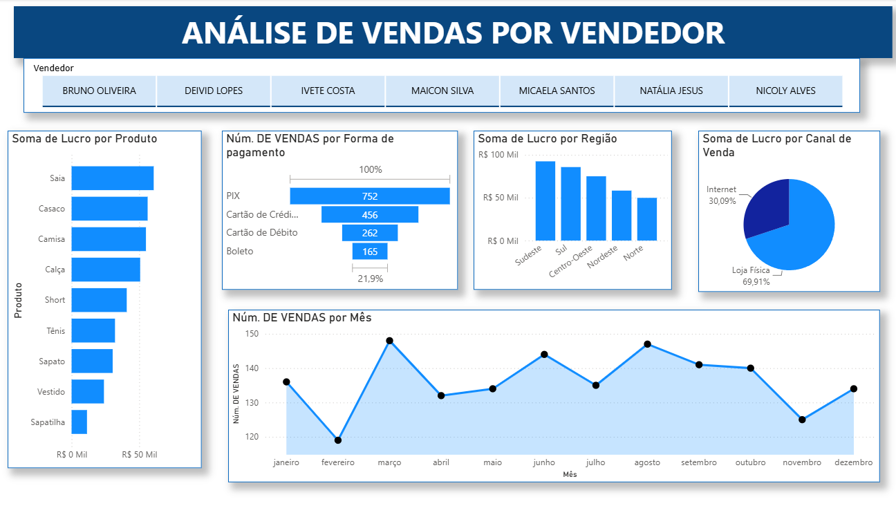

# 🛍️ Dashboard — Análise de Vendas por Produto e Vendedor

<div align="center">


### Dashboard construído no Power BI com foco em tratamento de dados e criação de medidas DAX

</div>

---

## 📌 Sobre o projeto

Este dashboard foi desenvolvido a partir de uma base fictícia de vendas, com o objetivo de praticar **tratamento de dados no Power Query** e **criação de medidas DAX**, analisando o desempenho de vendas sob duas perspectivas: **produto** e **vendedor**.

**Arquivo:** [`analise-vendas-produto-vendedor.pbix`](./analise-vendas-produto-vendedor.pbix)

**Páginas do relatório:** Produto · Vendedor

**Visuais utilizados:** gráfico de colunas (simples e agrupado), gráfico de barras, gráfico de rosca, gráfico de pizza, gráfico de linha, funil e segmentações.

---

## 🖼️ Prints do relatório

### 📦 Página Produto


---

### 🧑‍💼 Página Vendedor



---

## 🎯 Objetivos

Este projeto teve como principais objetivos:

- Praticar limpeza e transformação de dados no **Power Query**, incluindo divisão de colunas, substituição de valores e remoção de linhas em branco;
- Criar **medidas DAX customizadas** para métricas de negócio;
- Analisar o desempenho das vendas sob diferentes perspectivas, principalmente **produto x vendedor**;
- Desenvolver visualizações que facilitem a interpretação dos dados;
- Organizar um projeto de Power BI para publicação no GitHub.

---

## 🛠️ Tecnologias e recursos utilizados

### 📊 Power BI

Utilizado para criação do dashboard, desenvolvimento das visualizações e análise dos dados.

### 🔄 Power Query

Utilizado para realizar o tratamento e a transformação da base de dados, incluindo:

- Divisão de colunas por delimitador;
- Divisão de colunas por posição de caractere;
- Substituição de valores;
- Padronização de categorias;
- Remoção de linhas em branco;
- Ajuste e organização dos dados.

### 🧮 DAX

Foram criadas medidas personalizadas para auxiliar na análise dos indicadores.

Principais funções utilizadas:

```text
MAX
AVERAGE
COUNT
